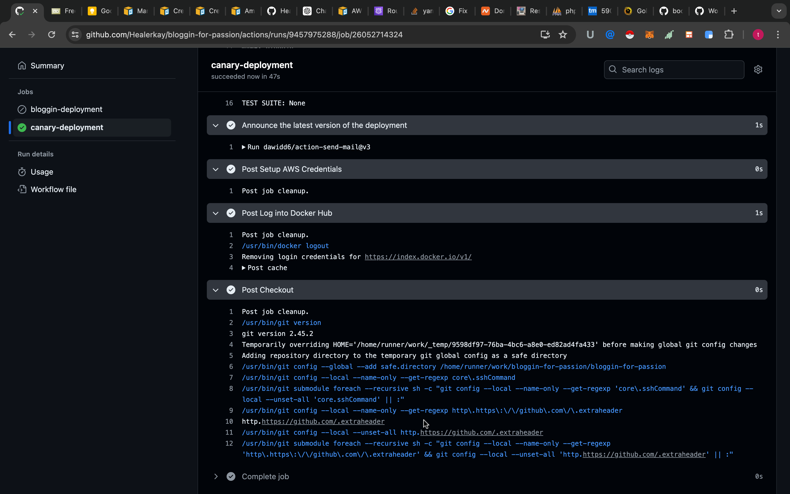
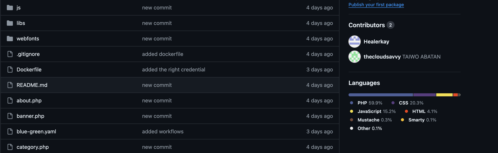

# A Sample Responsive Blogging platform
A simple PHP Blogging platform

### Technologies to Use:
* Kubernetes (EKS with eksctl)
* Ingress with SSL Certificate  (Cert-Manager)  

* GitHub Actions for CI/CD
* Docker for Containerization
* Amazon Route 53 for DNS Management
* MySQL for Database
* phpMyAdmin for Database Management
* Helm for Kubernetes Package Management
* Kubernetes Secrets and ConfigMaps
* OIDC for Authentication
* Persistent Volume Claims (PVC) and Storage Class for Data Persistence
* Sonarqube for continous integration && Testing
* Srometheus && grafana

## Setup to deploy on Aws Eks
1. write a docker compose file and build an image of it
2. Set up your cluster
3. Add OIDC and Ebsci driver for addons 
4. confirm your setup is running

```
 kubectl get pod -n kube-system
 ```

## setup for creating pipeline using github actions
1. In the same directory as your source, create a .github and workflows folders
2. create your configuration file (.yaml) in the workflows directory
3. choose a deployment strategies, here we use the canary deployment
4. write your configuration files and add necessary credentials to your secrets
5. deploy your application

##


## setup for ingress and cert-manager
1. Add ingress controller repo
2. Add cert-manager to make app secure
3. Add the cert-issuer configuration file
4. configure the ingress controller 

## Below is the outlook for the whole project


- The dns is mapped to name custom domain name
- THe application is secured      

  


## This project follows principle of devops
1. Continuous integration - using Github/actions  



2. Continous deployment/delivery     


3. continous monitoring - using prometheus & grafan  

  

.jpeg)  


 

4. continous collaboration - using github  



## Project status
- project is complete 


## Contact
Created by [@Thecloudsavvy](https://github.com/thecloudsavvy) && [@Healerkay](https://github.com/healerkay) - feel free to contact us!


